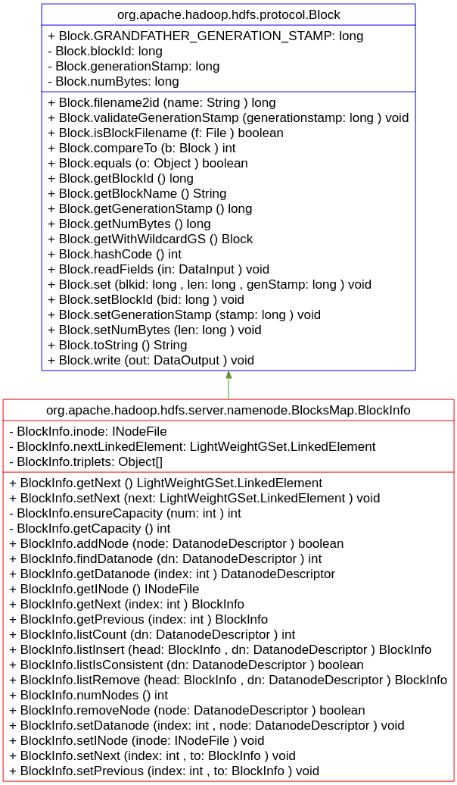

# Hadoop 1.2.1: Read The Fucking Source Code


## Architecture

- namenode to HDFS, as like superblock to fs
- datanode to HDFS, as like logical blocks to fs
- namenode maintains metadata via which data is accessed.
- namenode manages both **temporary** and **permanent** metadata, such as 

> 
- **namespace**: file hierarchy
- **block\->machine mapping**: block replicas placement
- **file->block list mapping**:  file blocks
- **machine list**: datanode servers

## NameNode

### Block Replicas Placement

#### 1. Block and BlockInfo structure**



**Block(hdfs/org/apache/hadoop/hdfs/protocol/Block.java)**

- long blockId
- long numBytes
- long generationStamp


**Generating random unique blockID**

- `FSNameSystem.randBlockId`:  random generator
- `FSNameSystem.allocateBlock`: allocate new block
- `FSNameSystem.isValidBlock`: determine if blockID of the new-allocated block already exists.

**FSNamesystem.allocateBlock**

``` 
// hdfs/org/apache/hadoop/hdfs/server/namenode/FSNamesystem.java-2087

  static Random randBlockId = new Random();
    
  /**
   * Allocate a block at the given pending filename
   * 
   * @param src path to the file
   * @param inodes INode representing each of the components of src. 
   *        <code>inodes[inodes.length-1]</code> is the INode for the file.
   */
  private Block allocateBlock(String src, INode[] inodes) throws IOException {
    Block b = new Block(FSNamesystem.randBlockId.nextLong(), 0, 0); 
    while(isValidBlock(b)) {
      b.setBlockId(FSNamesystem.randBlockId.nextLong());
    }
    b.setGenerationStamp(getGenerationStamp());
    b = dir.addBlock(src, inodes, b);
    NameNode.stateChangeLog.info("BLOCK* allocateBlock: "
                                 +src+ ". "+b);
    return b;
  }
```

**FSNamesystem.isValidBlock**

```
// hdfs/org/apache/hadoop/hdfs/server/namenode/FSNamesystem.java-5658

  /**
   * Returns whether the given block is one pointed-to by a file.
   */
  private boolean isValidBlock(Block b) {
    return (blocksMap.getINode(b) != null);
  }
```

**blockId and blockName**

- blk_${blockId}
- Block.filename2id:
- Block.getBlockName:

**Block.hashCode**

- used as hash function to hash map

```
// hdfs/org/apache/hadoop/hdfs/protocol/Block.java-185

  public int hashCode() {
    //GenerationStamp is IRRELEVANT and should not be used here
    return 37 * 17 + (int) (blockId^(blockId>>>32));
  }
```

**Block.equals**

- used to identify a block in BlockMap

```
// hdfs/org/apache/hadoop/hdfs/protocol/Block.java-173

  public boolean equals(Object o) {
    if (!(o instanceof Block)) {
      return false;
    }
    final Block that = (Block)o;
    //Wildcard generationStamp is ALLOWED here
    return this.blockId == that.blockId
      && GenerationStamp.equalsWithWildcard(
          this.generationStamp, that.generationStamp);
  }
```

**BlockInfo(hdfs/org/apache/hadoop/hdfs/server/namenode/BlocksMap.java)**

- INodeFile inode 
- LightWeightGSet.LinkedElement nextLinkedElement
- Object[] triplets

**BlockInfo.inode**

- the inode that the block belongs to


**Block.nextLinkedElement**

- blocks with the same colliding hash key connects each other via `nextLinkedElement` and form a single linked list.


**Block.triplets**

- the triplets is threefold.
- triplets of a k-replica block contains 3k elements.
- triplets[3n], triplets[3n+1], triplets[3n+2] keep DatanodeDescriptor, previous block and next block. triplets join the blocks that along to the same Datanode and form a doubly linked list.

#### 2.BlocksMap 

- hdfs/org/apache/hadoop/hdfs/server/namenode/BlocksMap.java

**BlocksMap.blocks**

- `private GSet<Block, BlockInfo> blocks`;
- LightWeightGSet is underlying **hashing** implementation of GSet
- BlocksMap has a limited number of slots.
- Each slot points to a single linked list of Blocks, hashCodes of which are `congruence modulo BlocksMap.size()`, 


**Footprint of BlocksMap.blocks**

- this.capacity determine the size of pre-allocated BlocksMap.
- The slots of BlocksMap occupies 2% maximum memory of the JVM.

```
// hdfs/org/apache/hadoop/hdfs/server/namenode/BlocksMap.java-317

  BlocksMap(int initialCapacity, float loadFactor) {
    // Use 2% of total memory to size the GSet capacity
    this.capacity = LightWeightGSet.computeCapacity(2.0, "BlocksMap");
    this.blocks = new LightWeightGSet<Block, BlockInfo>(capacity);
  }
```

- computeCapacity return the minimum power of 2, which percentage of max memory rounds up to, the return value never goes outsides of close interval [1, 2^30].

```
// hdfs/org/apache/hadoop/hdfs/util/LightWeightGSet.java-284 

  /**
   * Let t = percentage of max memory.
   * Let e = round(log_2 t).
   * Then, we choose capacity = 2^e/(size of reference),
   * unless it is outside the close interval [1, 2^30].
   */
  public static int computeCapacity(double percentage, String mapName) {
    return computeCapacity(Runtime.getRuntime().maxMemory(), percentage,
        mapName);
  }
  
  /** Visible for testing */
  static int computeCapacity(long maxMemory, double percentage,
      String mapName) {
    if (percentage > 100.0 || percentage < 0.0) {
      throw new IllegalArgumentException("Percentage " + percentage
          + " must be greater than or equal to 0 "
          + " and less than or equal to 100");
    }
    if (maxMemory < 0) {
      throw new IllegalArgumentException("Memory " + maxMemory
          + " must be greater than or equal to 0");
    }
    if (percentage == 0.0 || maxMemory == 0) {
      return 0;
    }
    //VM detection
    //See http://java.sun.com/docs/hotspot/HotSpotFAQ.html#64bit_detection
    final String vmBit = System.getProperty("sun.arch.data.model");

    //Percentage of max memory
    final double percentDivisor = 100.0/percentage;
    final double percentMemory = maxMemory/percentDivisor;
    
    //compute capacity
    final int e1 = (int)(Math.log(percentMemory)/Math.log(2.0) + 0.5);
    final int e2 = e1 - ("32".equals(vmBit)? 2: 3);
    final int exponent = e2 < 0? 0: e2 > 30? 30: e2;
    final int c = 1 << exponent;

    LOG.info("Computing capacity for map " + mapName);
    LOG.info("VM type       = " + vmBit + "-bit");
    LOG.info(percentage + "% max memory = " + maxMemory);
    LOG.info("capacity      = 2^" + exponent + " = " + c + " entries");
    return c;
  }
```

- slots of BlocksMap are stored in fixed-size array.

```
// hdfs/org/apache/hadoop/hdfs/util/LightWeightGSet.java-77

  public LightWeightGSet(final int recommended_length) {
    final int actual = actualArrayLength(recommended_length);
    LOG.info("recommended=" + recommended_length + ", actual=" + actual);

    entries = new LinkedElement[actual];
    hash_mask = entries.length - 1;
  }
```
- footprint of BlocksMap contains slots and metadata of Blocks.

```
e.g.
maximum memory of JVM: 1GB
slots use up 20MB.
a BlockInfo instance corresponding to a 3-replica block  occupies 112 Bytes:
neglects DatanodeDescriptor and Namespace.
so,  footprint=0.02*Xmx+112*N.
```


## Expose info

### JMX端口(tcp#10000):

```
# conf/hadoop-env.sh
export HADOOP_NAMENODE_OPTS="-Dcom.sun.management.jmxremote $HADOOP_NAMENODE_OPTS  \
    -Dcom.sun.management.jmxremote.port=10000 -Dcom.sun.management.jmxremote.ssl=false -Dcom.sun.management.jmxremote.authenticate=false"
```

### dfs.http.port端口(tcp#50070)和/dfs.datanode.http.address端口(tcp#50075).

```
# src/hdfs/org/apache/hadoop/hdfs/DFSConfigKeys.java
```


## DataNode


# 3.0.0.beta

INodeFile, BlockCollection, Block, Packet(64KB, 65016B, 126Chunk), Chunk(516B, 512B Data+4B Checksum)
DataStreamer


DataStreamer:  pipeline per block

- get blockId/location from namenode,
- send data to the first datanode, recv response from the last datanode
- dataflow and control flow separation


du -sb ./current/BP-1457023590-192.168.110.10-1512913889667/current/finalized/subdir0/subdir0/blk_1073741831
1048576	./current/BP-1457023590-192.168.110.10-1512913889667/current/finalized/subdir0/subdir0/blk_1073741831

du  -sb ./current/BP-1457023590-192.168.110.10-1512913889667/current/finalized/subdir0/subdir0/blk_1073741830_1006.meta
8199	./current/BP-1457023590-192.168.110.10-1512913889667/current/finalized/subdir0/subdir0/blk_1073741830_1006.meta


- meta file naming convention
- meta contain crc checksum for each chunk(512Bytes) of data, extra 3 bytes is used for what?


htrace for distributed trace


# Erasure Coding


## dataflow pipelining

- checksum per chunk
- sent by packet
- data clustered by block
- replicated by pipelining
- one-write-more-read


Q1: how to implement operation of append?

- create file, write one byte, close the file
- open the file for appending again, write one byte,  close the file.

Q2: multiple writers write data into the same block, what happens?

- user A open file, then create a packet, wait for a while, until
- user B open file, assembly a same-size packet and write.
- after user B receives response from DNs, then user A write its packet.

Q3: how to pick a sequence of data flow?

- whether client or NN determines order of pipeline?
- what's the meanings of rack-conscious?

Q4: lifetime of block?

- allocate block: allocate a block after the file is created, client ask NN to addBlock
- NN allocate a block with unique IDs,  pick DNs on which the block resides, But the NN never tell DNs to initialize the block.
- client write data to block, the block is initialized by client.
- beginBlock, writeTo,  endBlock,

Q5: there is no need separation of data flow and control flow.

- In GFS, multiple writers in different ranks can write data into block,  each write choose the best path to pipeline data,  so the leader replica need notified to determined sequence of records.
- but in HDFS, there is no a multiple block.


Q5:  data 


mvn-3.3.9 package -Pdist,native,docs -DskipTests -Dtar -Dmaven.javadoc.skip=true -pl '!hadoop-cloud-storage-project,!hadoop-client-modules' -DskipShade


org.apache.hadoop.hdfs.protocol.AlreadyBeingCreatedException

reopen a file


CreateFlag.CREATE =O_WRONLY|O_CREAT|O_EXCL

​	can not create a already-existing file

CreateFlag.APPEND=O_WRONLY|O_APPEND

​	atomic record write, lease mechanism employed

CreateFlag.OVERWRITE=O_WRONLY|O_TRUNC

​	recoverLease, unspecified


