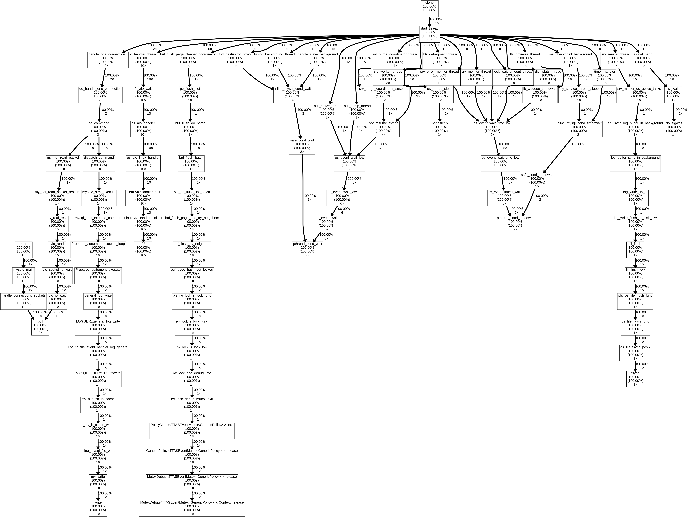
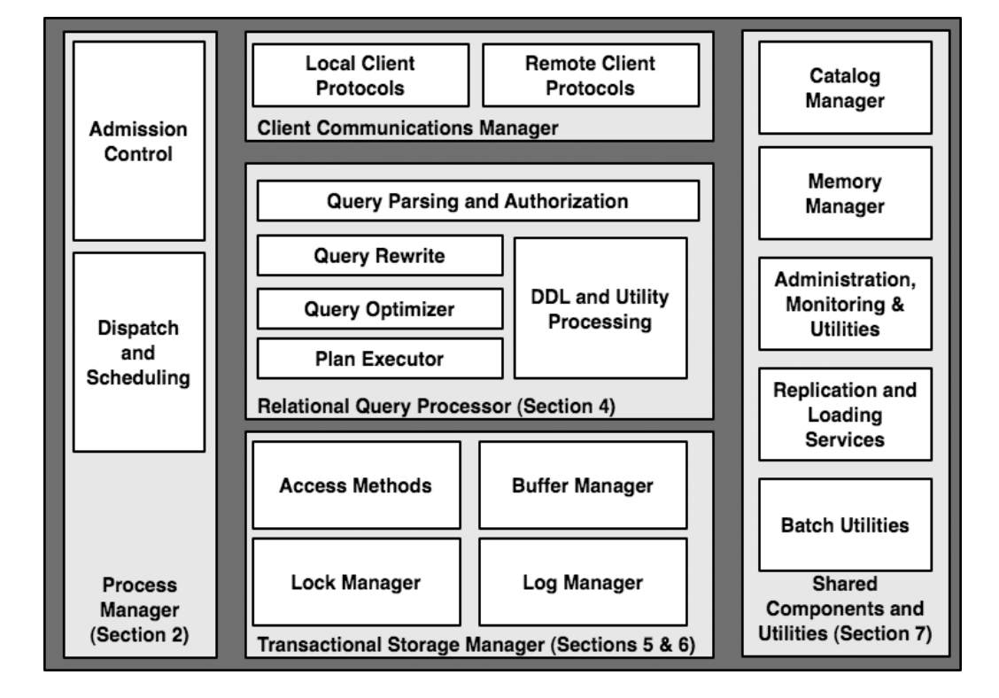

## 1. compile debug version of mariadb

```
cmake -DCMAKE_BUILD_TYPE=Debug -DCMAKE_CXX_FLAGS_DEBUG="-g -O0 -rdynamic -fno-inline -Wno-error"

make -j8
```

- build type: `CMAKE_BUILD_TYPE=Debug`
- per-config: `CMAKE_CXX_FLAGS_DEBUG`
- fno-inline: forbid inline function expansion
- Wno-error: not make all warnings into errors, otherwise building abort early.


## 2. start mysqld

[**running-mariadb-from-the-build-directory**](https://mariadb.com/kb/en/library/running-mariadb-from-the-build-directory/)

**write ~/.my.cnf**

- datadir=/home/grakra/data/mysql
- socket=/home/grakra/data/mysql/sock
- language=/home/grakra/workspace/mariadb/server/sql/share/english
- log-error=/home/grakra/data/mysql/error.log
- general-log=TRUE
- general-log-file=/home/grakra/data/mysql/general.log
- slow-query-log=TRUE
- slow-query-log-file=/home/grakra/data/mysql/slow.log

```
# Example mysql config file.
# You can copy this to one of:
# /etc/my.cnf to set global options,
# /mysql-data-dir/my.cnf to get server specific options or
# ~/my.cnf for user specific options.
# 
# One can use all long options that the program supports.
# Run the program with --help to get a list of available options

# This will be passed to all mysql clients
[client]
#password=my_password
#port=3306
#socket=/tmp/mysql.sock

# Here is entries for some specific programs
# The following values assume you have at least 32M ram

# The MySQL server
[mysqld]
#port=3306
#socket=/tmp/mysql.sock
temp-pool

# The following three entries caused mysqld 10.0.1-MariaDB (and possibly other versions) to abort...
# skip-locking
# set-variable  = key_buffer=16M
# set-variable  = thread_cache=4

loose-innodb_data_file_path = ibdata1:1000M
loose-mutex-deadlock-detector
gdb

######### Fix the two following paths

# Where you want to have your database
datadir=/home/grakra/data/mysql
socket=/home/grakra/data/mysql/sock
# Where you have your mysql/MariaDB source + sql/share/english
language=/home/grakra/workspace/mariadb/server/sql/share/english
log-error=/home/grakra/data/mysql/error.log
general-log=TRUE
general-log-file=/home/grakra/data/mysql/general.log
slow-query-log=TRUE
slow-query-log-file=/home/grakra/data/mysql/slow.log

########## One can also have a different path for different versions, to simplify development.

#[mariadb-10.1]
#lc-messages-dir=/my/maria-10.1/sql/share

#[mariadb-10.2]
#lc-messages-dir=/my/maria-10.2/sql/share

[mysqldump]
quick
set-variable = max_allowed_packet=16M

[mysql]
no-auto-rehash

[myisamchk]
set-variable= key_buffer=128M
```

```
./scripts/mysql_install_db --srcdir=$PWD --datadir=/home/grakra/data/mysql --user=$LOGNAME

sql/mysqld

mysql -S /home/grakra/data/mysql/sock
```
## 3. running TPC-C benchmark and generating flumegraph.

[**tpcc-mysql**](https://github.com/Percona-Lab/tpcc-mysql)

```
mysqladmin -S /home/grakra/data/mysql/sock -uroot create tpcc1000

mysql -S /home/grakra/data/mysql/sock -uroot tpcc1000 < create_table.sql

./tpcc_load -h127.0.0.1 -d tpcc1000 -u root -p "" -w 1000
```

meanwhile

[**FlameGraph**](https://github.com/brendangregg/FlameGraph)

```
perf record -F 99 -p $(ps h -C mysqld -o pid) -g -- sleep 60
perf script > out.perf
./stackcollapse-perf.pl ../tpcc-mysql/out.perf |./flamegraph.pl >mysql.svg
google-chrome-stable mysql.svg
```

## 4. A priori knowledge and guessing

**fact**
- disk-based and persistent=> call fsync when write WAL log and checkpoint.[must]
- support several engine=> separated WAL and engine. [maybe]
- consist of local store, txn CC, process model, query module, buffer pool, catalog, protocol and etc.=> start local store first.

## 5. Ag for fsync

- source code search is not a good way.
- so use gdb.

## 6. gdb

```
# enable gdb to attach to a process
su
echo 0 > /proc/sys/kernel/yama/ptrace_scope
exit

# hunt for fsync
gdb sql/mysqld 23372
br fsync
c
bt
generate-core-file mysqld_core.23372
```
```
#0  0x00007f80c6eebc60 in fsync () from /usr/lib/libpthread.so.0
#1  0x00005649da40ecaa in os_file_fsync_posix (file=10)
    at /home/grakra/workspace/mariadb/server/storage/innobase/os/os0file.cc:2426
#2  0x00005649da40f0d3 in os_file_flush_func (file=10)
    at /home/grakra/workspace/mariadb/server/storage/innobase/os/os0file.cc:2542
#3  0x00005649da65b789 in pfs_os_file_flush_func (file=..., 
    src_file=0x5649dab77360 "/home/grakra/workspace/mariadb/server/storage/innobase/fil/fil0fil.cc", src_line=962)
    at /home/grakra/workspace/mariadb/server/storage/innobase/include/os0file.ic:496
#4  0x00005649da65f2e2 in fil_flush_low (space=0x5649dc5b4e90)
    at /home/grakra/workspace/mariadb/server/storage/innobase/fil/fil0fil.cc:962
#5  0x00005649da66d53c in fil_flush (space_id=4294967280)
    at /home/grakra/workspace/mariadb/server/storage/innobase/fil/fil0fil.cc:5528
#6  0x00005649da3ec138 in log_write_flush_to_disk_low ()
    at /home/grakra/workspace/mariadb/server/storage/innobase/log/log0log.cc:1063
#7  0x00005649da3ecb92 in log_write_up_to (lsn=9832047807, flush_to_disk=true)
    at /home/grakra/workspace/mariadb/server/storage/innobase/log/log0log.cc:1291
#8  0x00005649da3ecd05 in log_buffer_sync_in_background (flush=true)
    at /home/grakra/workspace/mariadb/server/storage/innobase/log/log0log.cc:1337
#9  0x00005649da50cf66 in srv_sync_log_buffer_in_background ()
    at /home/grakra/workspace/mariadb/server/storage/innobase/srv/srv0srv.cc:2127
#10 0x00005649da50d4b1 in srv_master_do_active_tasks ()
    at /home/grakra/workspace/mariadb/server/storage/innobase/srv/srv0srv.cc:2300
#11 0x00005649da50ddea in srv_master_thread (arg=0x0)
    at /home/grakra/workspace/mariadb/server/storage/innobase/srv/srv0srv.cc:2511
#12 0x00007f80c6ee2049 in start_thread () from /usr/lib/libpthread.so.0
#13 0x00007f80c42b7f0f in clone () from /usr/lib/libc.so.6
```

```
gdb --batch --quiet -ex "thread apply all bt" -ex "quit" sql/mysqld mysqld_core.23372 > mysqld_gdb_stacktrace.dat
```

```
./stackcollapse-gdb.pl ../mariadb/server/mysqld_gdb_stacktrace.dat |./flamegraph.pl > mysqld_fsync.svg
```

```
pip install gprof2dot
```

```
./stacktrace2callgraph_gdb.pl ~/workspace/mariadb/server/mysqld_gdb_stacktrace.dat  |gprof2dot -c print | dot -Tpng -o mysqld_fsync.png
```



## 7. mariadb architecture

**in thread perspective**

- `mysqld_main`

> 
- main thread
- handle_connections_sockets:  listen and accept connection request from clients.

- `handle_one_connection`

> 
- each client has a corresponding `handle_one_connection` thread for communication.
- `my_net_read_packet`: recv req message from clients
- process cmd
- send resp message to clients

- `io_handler_thread`

> 
- *aio for network|disk ?*


- `buf_flush_page_cleaner_coordinator`

> 
- manage buffer pool?
- flush dirty pages to disk
- swap pre-fetching or on-command pages from disk.
- evict LRU pages.


- `thd_destructor_proxy`

> 
- reclaim unused threads?
- can the number of thread scales up as requests grows?
- catogory threads into daemon and non-daemon ones?
- the threads associated with a client session and threads for I/O should be non-daemon threads.
- process model and thread pool management.

- `binlog_background_thread`

> 
- record binlog
- is binlog is WAL log?

- `handle_slave_background`

> 
- for replication?

- `buf_resize_thread`

> 
- resize the buffer pool to avoid OOM?
- policy?
- in-the-fly?

- `buf_dump_thread`

> 
- why dump buf?
- for debug propose?
- for checkpointing propose?


- `srv_purge_coodinator_thread`

> 
- unknown?

- `srv_worker_thread`

> 
- unknown?

- `btr_defragment_thread`

> 
- btr means B tree?
- defragment what?

- `srv_error_monitor_thread`

> 
- monitor error event

- `srv_monitor_thread`

> 
- monitor non-error thread
- why not to unit `srv_error_monitor_thread` and `srv_monitor_thread` into one thread?

- `lock_wait_timeout_thread`

> 
- for deadlock?

- `fts_optimzed_thread`

> 
-  unknown

-  `dict_stats_thread`

> 
- unknown
- catalog


- `ma_checkpoint_thread`

> 
- checkpointing?

- `srv_master_thread`

> 
- write WAL?

- `timer_handler`

> 
- timer notification

- `signal_hand`

> 
- process signal

**in component perspective**

- main component of RDBMS



`Hellerstein, J. M., Stonebraker, M., & Hamilton, J. (2007). Architecture of a database system. Foundations and Trends® in Databases, 1(2), 141-259.`

- mysql architecture

>
- 1979, Monty Widenius, TcX, reporting tool written in BASIC, ran on 4Mhz computer with 16KB RAM.

- , Unireg, rewritten in C and portted to UNIX, low-level storage engine with a reporting front end.

- 1990s, push for SQL interface. 1. load data into a commercial database. 2. borrowing the SQL part from mSQL and integrated with low-level storage engine. 3. "I've had enough of those tools that somebody else wrote that don't work! I'm writing my own".

- May 1996, MySQL1.0, released to a limited group.
- Oct 1996, MySQL 3.11.1, public release, only a binary distribution for solaris.
- 1997~1998, portted to other OS as feature set gradually increased.
- 1998, MySQL MySQL 3.22,  features. 1. a decent subset of SQL lang, 2. sophisticated optimizer, 3. extremely fast, 4. vary stable. 5. multi-lang support. lacked support: 1. transactions, 2. subquery, 3. foreign keys, 4. stored procedures & views, only table-level locking. 
- 1999~2000, MySQL 3.23, MySQL AB and SleepyCat, SQL interface for Berkeley DB. could never work out all the quirks of the BDB interface, and the BDB tables was never stable. MySQL source became equipped with hooks to add any type of storage engine, including transacional one.

- Apr 2000, , Slashdot, master-slave replication, ISAM(non-txn)->MyISAM(txn), full-text search. Gemini(transactional engine, ended in a lawsuit towards the end of 2001).
- Oct 2001, MySQL4.0 alpha,  MySQL/InnoDB, Heikki Tuuri, InnoDB, row-level locking.
- early 2002, MySQL/InnoDB, stable.
- Mar 2003, MySQL4.0 production stable, query cache, replication code on the slave was rewritten to use two threads, one for network I/O from master, the other to process updates. optimizer improvements. client/server protocol become SSL-capable.
- April 2003, MySQL4.1 alpha,
- June 2004, MySQL4.1 beta, subqueries, spatial indexing support was added to MyISAM. Unicode support. more secure client/server protocol. supported prepared statements.
- Oct 2004, MySQL4.1 stable.
- Dec 2003, MySQL5.0 alpha, stored procedures, server-side curosrs, tiggers, views, XA -transactions, query optimizer improvement
- Oct 2005, MySQL5.0 stable.
- Nov 2005, MySQL5.1 alpha, table data partitioning, row-based replication, event scheduler, standardized plug-in API that facilitates the integration of new storage engines and other plugins.

- 5.0: stable, 5.1: beta, 5.2:new features.


## 8. decomposed table handler and storage engine


choose the simplest storage engine: `storage/csv`

-  create table: `test.csv_test`

[ref: csv-overview](https://mariadb.com/kb/en/library/csv-overview/)

- set breakpoints on `ha_tina::method` 

```shell
perl -lne 'print "br $1" if /(ha_tina::\w+\b)/' storage/csv/ha_tina.cc \
|sort -u |tee mariadb.gdb


br ha_tina::chain_append
br ha_tina::check
br ha_tina::check_and_repair
br ha_tina::check_if_incompatible_data
br ha_tina::close
br ha_tina::create
br ha_tina::delete_all_rows
br ha_tina::delete_row
br ha_tina::encode_quote
br ha_tina::external_lock
br ha_tina::extra
br ha_tina::find_current_row
br ha_tina::free_share
br ha_tina::get_status
br ha_tina::get_write_pos
br ha_tina::ha_tina
br ha_tina::info
br ha_tina::init_data_file
br ha_tina::init_tina_writer
br ha_tina::is_crashed
br ha_tina::open
br ha_tina::open_update_temp_file_if_needed
br ha_tina::position
br ha_tina::read_meta_file
br ha_tina::repair
br ha_tina::reset
br ha_tina::rnd_end
br ha_tina::rnd_init
br ha_tina::rnd_next
br ha_tina::rnd_pos
br ha_tina::store_lock
br ha_tina::update_row
br ha_tina::update_status
br ha_tina::write_meta_file
br ha_tina::write_row
```


[dbug](https://dev.mysql.com/doc/refman/5.7/en/dbug-package.html)

```shell
# enable dbug in cmdline options
sql/mysqld --console --debug

# enable dbug on-the-fly by using client
mysql> set debug ='t:i:d:o,mysqld.trace'
mysql> select @@debug;
mysql> show variables likes "debug";
mysql> show  variables where Variable_name ="debug";

```


```shell
su
echo 0 > /proc/sys/kernel/yama/ptrace_scope
gdb sql/mysqld $(ps h -C mysqld -o pid)
```

